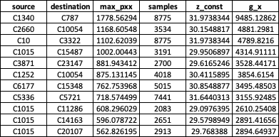

# Botnet Detection Algorithm
A botnet detection algorithm developed using Fourier analysis and data from the Los Alamos National Laboratory for cybersecurity work.

> **Abstract**

The objective of this algorithm is to identify highly periodic edges
from network logs at scale which are likely to be part of the beginning
of a botnet attack. This algorithm's main strategy is detecting C2
traffic, which is a precursor to a botnet attack. This behavior is
needed for the bot to: - 1) update their data, 2) receive commands, 3)
send keep-alive messages. The behavior is observed when looking at the
transport port of the of the bot for its C2 communication.

**Method**

Compute periodogram which identifies the peak of the frequency domain of
the discrete time series traffic signal. After peak is located, Walker’s
large sample test is applied to confirm that the peak is significant
enough compared to the rest of the periodogram’s ordinates. We compute
the peak and confirm with Walker’s test for different discrete time
intervals. The peak of the frequency domain is obtained by computing the
power spectral density of the network traffic which can be estimated
using the Fourier transform of the autocorrelation function or a
periodogram. The periodogram of a time sequence gives its power at
different frequencies.

We used LANL dataset to validate this algorithm. A typical day’s network
traffic log looks like this:

- Duration 24 hours

- Hosts = 8906

- 73,784 edges

- No. of events = 9 Million

In order to compute the periodogram there is a need to reduce events as
the computation is costly – it costs about 2 secs to compute the
periodogram of one edge. We developed two segmentation techniques which
work well in this regard.

Segmentation 1: identify unidirectional edges

- Firewalls will only allow traffic going out and not coming in
  especially if its dubious traffic that might be coming from a
  malicious site or unknown site or poor reputation sites etc.

- Removing bidirectional edges reduces number of edges to 10,902 and
  number of events to 1.5 Million

Segmentation 2: remove byte/packet communications with low frequency

- Low frequency of similar byte/packet connections means there are very
  few ‘botnet-like’ connections because it points towards low
  repeatability.

- When communications from the same edge represents the same bytes being
  transmitted, this resembles botnet communications.

- By filtering highly repeatable bytes/packet within the same edge we
  minimize the total number of edges that are of interest.

- Isolating edges that have more than 1000 times the average number of
  bytes/packet for an edge reduces number of edges of interest by 99% (
  9 Million to 762)

Combining the two segmentation strategies, leads to a set of 107 edges
that we need to compute their periodogram. Computing periodogram for 107
edges takes 150 secs on a laptop.

**Compute periodogram**

We compute the maximum spectral density (periodogram) at different
discrete time intervals (1s – 15s). This is mainly because different
time intervals affect the maximum periodogram and there is no knowing
beforehand which is the ideal time interval to consider. We suspect that
durations greater than one minute are less likely to be exhibited by
botnets. After computing the periodogram, it is important to select only
the edges that whose periodogram meets the statistical sample size
requirements in order to minimize error. Also edges with high values of
the periodogram computation are more likely to exhibit botnet behavior.
We selected edges that had maximum periodogram readings higher than 500.
This number can be adjusted accordingly depending on how many edges one
can handle.

We apply walker’s large test to the periodogram’s maximum ordinate to
determine if it is periodic or not.

**<u>Results</u>**

These are end points that have maximum periodogram value \> 500 (most
likely to be periodic) in one day.

The figures below show the distribution of traffic for each end point

<u>C1340 – C787</u>

| **Time(sec)** | **counts** |
|---------------|------------|
| 16            | 6082       |
| 15            | 9          |
| 17            | 8          |



<u>C1015 – C15487</u>

| **Time(sec)** | **counts** |
|---------------|------------|
| 30            | 3176       |
| 31            | 42         |
| 29            | 34         |

<u>C3871 – C23147</u>

| **Time(sec)** | **counts** |
|---------------|------------|
| 26            | 3531       |
| 25            | 203        |
| 27            | 26         |

<u>  
</u>

<u>C1015 – C12562</u>

| **Time(sec)** | **counts** |
|---------------|------------|
| 0             | 1843       |
| 22            | 1383       |
| 2             | 1153       |
| 6             | 968        |
| 24            | 949        |
| 21            | 812        |
| 1             | 735        |
| 5             | 258        |
| 23            | 196        |
| 25            | 158        |
| 3             | 90         |
| 10            | 74         |
| 14            | 54         |
| 8             | 54         |
| 13            | 29         |
| 43            | 28         |
| 11            | 27         |
| 44            | 23         |
| 9             | 22         |
| 4             | 20         |
| 12            | 18         |
| 19            | 17         |
| 20            | 17         |
| 17            | 16         |
| 18            | 14         |
| 16            | 14         |
| 7             | 13         |
| 15            | 12         |

<u>C17693 – C5074</u>

| **Time(sec)** | **counts** |
|---------------|------------|
| 10            | 8943       |
| 11            | 646        |
| 9             | 84         |
| 12            | 10         |
| 13            | 2          |
| 14            | 1          |
| 16            | 1          |
| 28            | 1          |
| 47            | 1          |
| 54            | 1          |

<u>C1015 – C11114</u>

| **Time(sec)** | **counts** |
|---------------|------------|
| 0             | 15700      |
| 37            | 1887       |
| 36            | 742        |
| 1             | 350        |
| 38            | 15         |
| 15            | 1          |
| 21            | 1          |
| 39            | 1          |
| 40            | 1          |

<u>C3173 – C1554</u>

| **Time(sec)** | **counts** |
|---------------|------------|
| 0             | 5705       |
| 30            | 2382       |
| 1             | 351        |
| 20            | 70         |
| 29            | 54         |
| 21            | 48         |
| 2             | 45         |
| 13            | 40         |
| 4             | 36         |
| 5             | 36         |
| 10            | 34         |
| 14            | 33         |
| 17            | 32         |
| 11            | 31         |
| 19            | 31         |
| 9             | 31         |
| 18            | 30         |
| 7             | 30         |
| 8             | 30         |
| 16            | 30         |

<u>C1015 – C14163  
</u>

| **Time(sec)** | **counts** |
|---------------|------------|
| 37            | 829        |
| 38            | 825        |
| 39            | 693        |
| 36            | 149        |
| 40            | 44         |
| 35            | 18         |
| 41            | 17         |
| 34            | 2          |

<u>  
</u>

The tables below the top daily edges based on maximum periodogram values
and exhibit most probable behavior of botnets.

<u>Day 2</u>

<u>Day 3</u>

<u>Day 4</u>

<u>Day 5</u>

<u>Day 6</u>

<u>Day 7</u>

<u>Conclusion</u>

The results show that as the maximum periodogram reduces, the periodic
behavior on edge also reduces accordingly. Among the top periodic edges,
we are able to identify an edge which is a subject of lots of redteam
events which is a possible candidate of botnet behavior.
